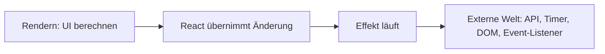
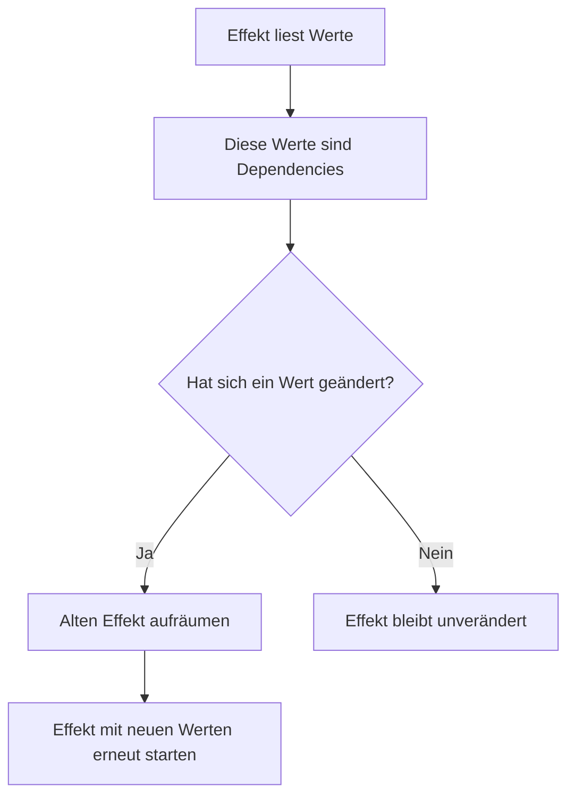
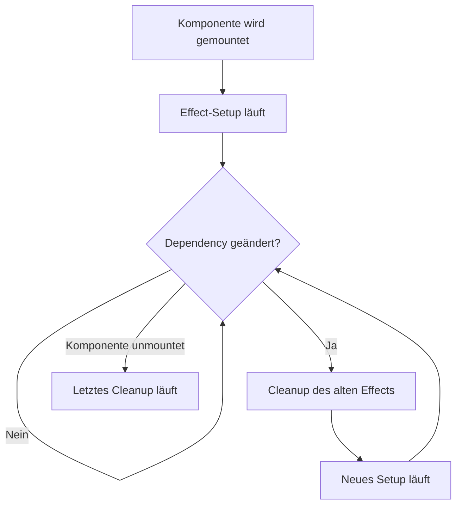

###### Themen

useEffect: Nebenwirkungen in React

- Was ist ein Effekt in React?
- Wofür wird `useEffect` verwendet?
- Einfacher API-Aufruf mit `useEffect`

Abhängigkeiten und Aufräumarbeiten

- Dependency Array einfach verstehen
- Wann ein Effekt erneut ausgeführt wird
- Cleanup-Funktionen bei einfachen Beispielen (z. B. Timer, Event-Listener)

<br><br><br>
# ⚛️ useEffect: Nebenwirkungen in React

<br><br><br>
## 🧠 Was ist ein Effekt in React?

Ein **Effekt** ist in React Code, der **nicht nur die Benutzeroberfläche berechnet**, sondern **etwas außerhalb von React beeinflusst oder mit etwas außerhalb synchronisiert**. Genau dafür ist `useEffect` da: React beschreibt damit die Synchronisation einer Komponente mit einem **externen System** wie Netzwerk, Browser-API, Timer, Event-Listener, WebSocket oder DOM-API ([useEffect – React](https://react.dev/reference/react/useEffect)).

Wichtig ist dabei der Unterschied zwischen **Rendern** und **Effekt**:

- Beim **Rendern** berechnet React nur, **wie die Oberfläche aussehen soll**.
- Ein **Effekt** passiert **danach**, wenn React die Änderung übernommen hat.

Das ist so wichtig, weil React-Komponenten beim Rendern **möglichst rein** bleiben sollen. Eine Komponente soll beim Rendern nicht plötzlich einen Timer starten, Daten laden oder einen Listener am `window` registrieren. Solche Dinge gehören in einen Effekt, nicht direkt in den Funktionskörper der Komponente ([Synchronizing with Effects – React](https://react.dev/learn/synchronizing-with-effects)).

Ein einfaches Bild dazu:



Ein Effekt ist also immer dann sinnvoll, wenn deine Komponente mit etwas **außerhalb der React-Logik** zusammenarbeiten muss.

Ein kleines Beispiel:

```jsx
import { useEffect } from 'react';

function Warenkorb({ anzahl }) {
  useEffect(() => {
    document.title = `Warenkorb (${anzahl})`;
  }, [anzahl]);

  return <h1>{anzahl} Produkte im Warenkorb</h1>;
}
```

Hier berechnet React beim Rendern das `<h1>`. Das Ändern von `document.title` gehört aber nicht zur JSX-Ausgabe. Es ist eine Nebenwirkung im Browser und deshalb ein typischer Fall für `useEffect`.

Ein Effekt ist **nicht** dafür da, normale Werte aus anderen Werten zu berechnen. Wenn du zum Beispiel aus `vorname` und `nachname` nur einen `vollerName` zusammensetzen willst, brauchst du dafür **keinen Effekt**. Das sollte direkt im Rendern oder mit `useMemo` passieren. React empfiehlt ausdrücklich, Effekte nicht für unnötige abgeleitete Zustände zu verwenden ([You Might Not Need an Effect – React](https://react.dev/learn/you-might-not-need-an-effect)).

Beispiel für etwas, das **kein Effekt** sein sollte:

```jsx
function Profil({ vorname, nachname }) {
  const vollerName = `${vorname} ${nachname}`;
  return <p>{vollerName}</p>;
}
```

Hier passiert nichts außerhalb von React. Deshalb ist `useEffect` unnötig.


<br><br><br>
## 🎯 Wofür wird `useEffect` verwendet?

`useEffect` wird verwendet, wenn deine Komponente **nach dem Rendern** etwas tun muss, das mit der Außenwelt zu tun hat. React nennt als typische Fälle unter anderem:

- Daten von einer API laden
- Eine Verbindung zu einem Server herstellen
- Einen Timer starten
- Einen Event-Listener registrieren
- Ein externes UI-Widget steuern
- Browser-Daten wie `document.title`, `localStorage` oder `navigator` nutzen ([useEffect – React](https://react.dev/reference/react/useEffect))

Das Entscheidende ist: `useEffect` ist kein allgemeiner „Hier kommt mein Code rein“-Haken. Es ist ein Werkzeug für ganz bestimmte Aufgaben.

### Typische sinnvolle Einsätze

Wenn du zum Beispiel beim Laden einer Komponente Daten abrufen willst, ist das ein externer Vorgang. Wenn du ein Resize-Event des Browsers abonnieren willst, ebenfalls. Wenn du jede Sekunde etwas aktualisieren willst, brauchst du einen Timer. All das sind klassische Fälle.

### Typische falsche Einsätze

Viele Anfänger benutzen `useEffect` für Dinge, die man einfacher direkt im Rendern lösen kann. Zum Beispiel:

- aus Props einen neuen State zusammensetzen
- Listen filtern, obwohl man das direkt berechnen könnte
- Werte synchron halten, die eigentlich nur abgeleitet sind

Das führt oft zu unnötigem Code, doppelten Rendern und Fehlern. React weist deshalb darauf hin, dass man **zuerst prüfen sollte, ob man wirklich einen Effekt braucht** ([You Might Not Need an Effect – React](https://react.dev/learn/you-might-not-need-an-effect)).

Ein typisches Denkschema ist:

| Frage | Brauche ich `useEffect`? |
|---|---|
| Ich berechne nur UI aus Props und State | Nein |
| Ich spreche mit einer API, einem Timer, DOM oder Browser-Event | Ja |
| Ich will Daten zwischen React und externem System synchron halten | Ja |
| Ich will nur einen Wert aus anderen Werten ableiten | Nein |

Die Grundform von `useEffect` sieht so aus:

```jsx
useEffect(() => {
  // Effekt-Code
}, [abhaengigkeiten]);
```

Dabei ist der erste Teil die Funktion mit dem Effekt. Der zweite Teil, das **Dependency Array**, steuert, wann React den Effekt erneut ausführt. Das schauen wir später noch genau an.


<br><br><br>
## 🌐 Einfacher API-Aufruf mit `useEffect`

Ein sehr klassischer Einsatz von `useEffect` ist das **Laden von Daten von einer API**, nachdem eine Komponente angezeigt wurde. Der Browser stellt dafür die `fetch`-API bereit ([Fetch API – MDN](https://developer.mozilla.org/docs/Web/API/Fetch_API)).

Ein einfaches Beispiel:

```jsx
import { useEffect, useState } from 'react';

export default function BenutzerListe() {
  const [benutzer, setBenutzer] = useState([]);
  const [laedt, setLaedt] = useState(true);
  const [fehler, setFehler] = useState(null);

  useEffect(() => {
    async function ladeBenutzer() {
      try {
        setLaedt(true);
        setFehler(null);

        const response = await fetch('https://jsonplaceholder.typicode.com/users');

        if (!response.ok) {
          throw new Error('Die Benutzerdaten konnten nicht geladen werden.');
        }

        const daten = await response.json();
        setBenutzer(daten);
      } catch (err) {
        setFehler(err.message);
      } finally {
        setLaedt(false);
      }
    }

    ladeBenutzer();
  }, []);

  if (laedt) {
    return <p>Daten werden geladen...</p>;
  }

  if (fehler) {
    return <p>Fehler: {fehler}</p>;
  }

  return (
    <ul>
      {benutzer.map((user) => (
        <li key={user.id}>{user.name}</li>
      ))}
    </ul>
  );
}
```

Schauen wir uns an, was hier genau passiert.

Im State speichern wir drei Dinge:

- `benutzer`: die geladenen Daten
- `laedt`: ob gerade geladen wird
- `fehler`: ob ein Fehler aufgetreten ist

Dann kommt der Effekt:

```jsx
useEffect(() => {
  async function ladeBenutzer() {
    ...
  }

  ladeBenutzer();
}, []);
```

Das leere Dependency Array `[]` bedeutet hier: **Führe den Effekt nach dem ersten Einbauen der Komponente aus**. Oft sagt man vereinfacht: „einmal beim Laden der Komponente“. Ganz exakt läuft der Effekt nach dem Mount der Komponente ([useEffect – React](https://react.dev/reference/react/useEffect)).

### Warum liegt der API-Aufruf im Effekt?

Weil ein Netzwerkaufruf eine klassische Nebenwirkung ist. Während des Renderns soll React nur berechnen, welche UI angezeigt wird. Ein `fetch()` startet aber Kommunikation mit einem Server. Das ist externe Arbeit und gehört deshalb in `useEffect`.

### Warum wird eine innere async-Funktion verwendet?

Die Effekt-Funktion selbst sollte nicht direkt `async` sein, weil ein Effekt entweder **nichts** oder eine **Cleanup-Funktion** zurückgeben soll. Eine `async`-Funktion gibt aber immer ein Promise zurück. Deshalb schreibt man in der Praxis oft eine innere `async`-Funktion und ruft sie dann im Effekt auf ([useEffect – React](https://react.dev/reference/react/useEffect)).

### Was passiert bei Fehlern?

Ein `fetch()` wirft nicht automatisch bei jedem HTTP-Fehler wie `404` oder `500` eine Exception. Deshalb prüft man oft zusätzlich `response.ok`. Wenn das `false` ist, wirft man selbst einen Fehler. Das ist ein sehr sauberer Standard.

### Etwas robuster mit `AbortController`

Wenn die Komponente verschwindet, während die Anfrage noch läuft, ist es sinnvoll, die Anfrage abzubrechen. Dafür gibt es `AbortController` im Browser ([AbortController – MDN](https://developer.mozilla.org/docs/Web/API/AbortController)).

```jsx
import { useEffect, useState } from 'react';

export default function BenutzerListe() {
  const [benutzer, setBenutzer] = useState([]);
  const [laedt, setLaedt] = useState(true);
  const [fehler, setFehler] = useState(null);

  useEffect(() => {
    const controller = new AbortController();

    async function ladeBenutzer() {
      try {
        setLaedt(true);
        setFehler(null);

        const response = await fetch(
          'https://jsonplaceholder.typicode.com/users',
          { signal: controller.signal }
        );

        if (!response.ok) {
          throw new Error('Die Benutzerdaten konnten nicht geladen werden.');
        }

        const daten = await response.json();
        setBenutzer(daten);
      } catch (err) {
        if (err.name !== 'AbortError') {
          setFehler(err.message);
        }
      } finally {
        if (!controller.signal.aborted) {
          setLaedt(false);
        }
      }
    }

    ladeBenutzer();

    return () => {
      controller.abort();
    };
  }, []);

  if (laedt) {
    return <p>Daten werden geladen...</p>;
  }

  if (fehler) {
    return <p>Fehler: {fehler}</p>;
  }

  return (
    <ul>
      {benutzer.map((user) => (
        <li key={user.id}>{user.name}</li>
      ))}
    </ul>
  );
}
```

Hier siehst du schon eine wichtige Eigenschaft von Effekten: Sie können **aufräumen**, also etwas wieder zurückbauen. Genau das machen wir später noch ausführlicher mit Timern und Event-Listenern.

In React 19 ist `useEffect` weiterhin ein normaler Weg für **clientseitiges Laden von Daten**, besonders wenn eine Client-Komponente direkt im Browser Daten holen soll. Gleichzeitig weist React darauf hin, dass Datenladen direkt in Effekten je nach Architektur Nachteile haben kann, etwa spätes Laden erst nach dem Rendern. In Frameworks werden deshalb oft eingebaute Datenlade-Mechanismen bevorzugt ([useEffect – React](https://react.dev/reference/react/useEffect)).


<br><br><br>
# 🔄 Abhängigkeiten und Aufräumarbeiten

<br><br><br>
## 🧩 Dependency Array einfach verstehen

Das **Dependency Array** ist der zweite Parameter von `useEffect`:

```jsx
useEffect(() => {
  // Effekt
}, [wert1, wert2]);
```

Dieses Array sagt React, **von welchen Werten der Effekt abhängt**. Wenn sich einer dieser Werte ändert, wird der Effekt erneut ausgeführt. React vergleicht diese Werte dabei mit `Object.is` ([useEffect – React](https://react.dev/reference/react/useEffect)).

Ganz wichtig: Das Dependency Array ist **nicht** einfach eine Wunschliste nach dem Motto „Was soll ich hier mal eintragen?“. Es muss die **reaktiven Werte enthalten, die im Effekt verwendet werden**. Dazu zählen vor allem:

- Props
- State
- Variablen, die in der Komponente definiert sind
- Funktionen, die in der Komponente definiert sind ([Removing Effect Dependencies – React](https://react.dev/learn/removing-effect-dependencies))

Ein sehr hilfreiches Grundverständnis ist:

> Das Dependency Array beschreibt, von welchen Werten dein Effekt liest.

Wenn dein Effekt also `userId` benutzt, dann gehört `userId` in die Dependencies.

Beispiel:

```jsx
function Profil({ userId }) {
  useEffect(() => {
    console.log('Lade Profil für', userId);
  }, [userId]);

  return <p>Profil</p>;
}
```

Hier hängt der Effekt von `userId` ab. Wenn sich `userId` ändert, soll der Effekt erneut laufen.

### Die drei häufigsten Varianten

| Schreibweise | Bedeutung | Typischer Fall |
|---|---|---|
| `useEffect(fn)` | Effekt läuft nach jedem Render | Selten sinnvoll |
| `useEffect(fn, [])` | Effekt läuft nach dem ersten Mount | Einmaliges Setup |
| `useEffect(fn, [a, b])` | Effekt läuft nach Mount und bei Änderung von `a` oder `b` | Synchronisation mit bestimmten Werten |

### 1. Ohne Dependency Array

```jsx
useEffect(() => {
  console.log('Läuft nach jedem Render');
});
```

Ohne Array läuft der Effekt nach **jedem** Render. Das ist oft zu viel und wird eher selten gebraucht. Wenn der Effekt wiederum State ändert, kann das sehr schnell zu Endlosschleifen führen.

### 2. Mit leerem Dependency Array

```jsx
useEffect(() => {
  console.log('Läuft einmal nach dem Mount');
}, []);
```

Das ist der klassische Fall für „einmal starten“, zum Beispiel bei einem initialen API-Aufruf, einem Event-Listener oder einem Timer.

### 3. Mit konkreten Abhängigkeiten

```jsx
useEffect(() => {
  console.log('Die Kategorie hat sich geändert:', kategorie);
}, [kategorie]);
```

Hier läuft der Effekt beim ersten Einbauen und danach immer dann, wenn sich `kategorie` ändert.

### Warum ist das so wichtig?

Weil React dadurch weiß, **wann der Effekt noch aktuell ist** und wann er neu synchronisiert werden muss. Wenn du einen Wert im Effekt benutzt, ihn aber nicht in die Dependencies aufnimmst, kann dein Effekt mit **alten Werten** arbeiten. Dann entstehen typische Bugs: veraltete Daten, nicht reagierende Listener oder falsche Timerlogik ([Lifecycle of Reactive Effects – React](https://react.dev/learn/lifecycle-of-reactive-effects)).

Ein kleines Bild dazu:



Ein ganz typischer Anfängerfehler ist, absichtlich Dinge aus dem Array wegzulassen, damit der Effekt „nicht so oft“ läuft. Das wirkt manchmal kurzfristig praktisch, ist aber meistens fachlich falsch. Der richtige Weg ist nicht, Dependencies zu verstecken, sondern den Effekt sauber umzubauen, wenn er zu oft neu läuft ([Removing Effect Dependencies – React](https://react.dev/learn/removing-effect-dependencies)).


<br><br><br>
## ⏱️ Wann ein Effekt erneut ausgeführt wird

Ein Effekt hat in React sozusagen einen kleinen Lebenszyklus. React erklärt das nicht einfach als „Mount und Unmount“, sondern als wiederholtes **Starten** und **Stoppen** einer Synchronisation ([Lifecycle of Reactive Effects – React](https://react.dev/learn/lifecycle-of-reactive-effects)).

Der Ablauf ist meistens so:

1. Die Komponente wird eingebaut.
2. React führt den Effekt aus.
3. Später ändert sich eine Dependency.
4. React räumt den alten Effekt auf.
5. React startet den Effekt neu, jetzt mit den neuen Werten.
6. Beim Entfernen der Komponente wird noch einmal aufgeräumt.

Als Ablaufdiagramm:



### Ein konkretes Beispiel

```jsx
function Chat({ roomId }) {
  useEffect(() => {
    console.log('Verbinde mit Raum', roomId);

    return () => {
      console.log('Trenne Verbindung zu Raum', roomId);
    };
  }, [roomId]);

  return <p>Aktueller Raum: {roomId}</p>;
}
```

Wenn `roomId` zuerst `general` ist, dann verbindet sich der Effekt mit `general`.

Wenn `roomId` später `technik` wird, passiert **nicht einfach nur ein zweiter Start**, sondern:

1. React ruft zuerst das Cleanup für `general` auf.
2. Danach startet React den Effekt neu für `technik`.

Das ist extrem wichtig. Ein Effekt wird also bei geänderten Dependencies normalerweise nach diesem Muster behandelt:

- **erst Cleanup**
- **dann neues Setup**

Genau deshalb sollen Effekte so geschrieben sein, dass sie immer sauber wieder beendet und neu gestartet werden können.

### Wann genau läuft ein Effekt?

Vereinfacht gesagt läuft `useEffect`, nachdem React die Änderung übernommen hat. React kann dabei je nach Situation entscheiden, wann der Effekt relativ zum Browser-Paint ausgeführt wird. Für das normale Verständnis reicht aber: `useEffect` läuft **nicht während des Renderns**, sondern **danach** ([useEffect – React](https://react.dev/reference/react/useEffect)).

### Wodurch wird ein erneutes Ausführen ausgelöst?

Ein Effekt wird erneut ausgeführt, wenn mindestens eine seiner Dependencies sich geändert hat. Das kann zum Beispiel sein:

- ein Prop wurde neu übergeben
- ein State-Wert wurde geändert
- eine im Komponentenrumpf definierte Funktion oder ein Objekt hat sich neu erzeugt

Gerade der letzte Punkt ist wichtig. In JavaScript sind Objekte und Funktionen oft bei jedem Rendern „neu“, auch wenn sie gleich aussehen. Dadurch können Effekte unerwartet oft neu starten. React beschreibt dieses Problem ausdrücklich und zeigt, dass man unnötige Objekt- und Funktions-Dependencies vermeiden sollte ([useEffect – React](https://react.dev/reference/react/useEffect)).

### Besonderheit in React 19: Verhalten im Entwicklungsmodus

Wenn du im Entwicklungsmodus mit `StrictMode` arbeitest, führt React den Effekt beim Start absichtlich **einmal zusätzlich als Test** aus: Setup, Cleanup, dann noch einmal Setup. Das soll dir zeigen, ob dein Cleanup korrekt funktioniert ([useEffect – React](https://react.dev/reference/react/useEffect)).

Das führt oft zu Verwirrung, weil man denkt: „Warum läuft mein Effekt doppelt?“ Die Antwort ist dann oft: **weil React im Development prüft, ob dein Effekt robust geschrieben ist**.

Praktisch heißt das:

- In der Entwicklung kann ein Effekt beim Start öfter wirken als erwartet.
- In der Produktion passiert dieses zusätzliche Test-Verhalten nicht.
- Wenn dein Cleanup korrekt ist, ist das kein Problem.

Das ist besonders bei API-Aufrufen, Timern und Event-Listenern wichtig. Wenn dort unsauber gearbeitet wird, zeigt der Entwicklungsmodus den Fehler oft sofort.


<br><br><br>
## 🧹 Cleanup-Funktionen bei einfachen Beispielen

Eine Cleanup-Funktion ist der **Rückgabewert** deines Effekts:

```jsx
useEffect(() => {
  // Setup

  return () => {
    // Cleanup
  };
}, []);
```

React ruft diese Funktion auf,

- **bevor** der Effekt wegen geänderter Dependencies neu gestartet wird
- und **wenn** die Komponente entfernt wird ([useEffect – React](https://react.dev/reference/react/useEffect))

Cleanup bedeutet also: Alles, was dein Effekt aufgebaut hat, soll wieder sauber abgebaut werden.

Typische Beispiele sind:

- Timer beenden
- Event-Listener entfernen
- Verbindungen trennen
- laufende Requests abbrechen

Ohne Cleanup entstehen schnell Probleme wie doppelte Listener, mehrfach laufende Timer, unnötige Speicherbelegung oder Verhalten mit alten Werten.


<br><br><br>
### ⏲️ Timer mit `setInterval`

Wenn du mit `setInterval` arbeitest, startet der Browser eine Funktion in einem festen Zeitabstand ([Window: setInterval() – MDN](https://developer.mozilla.org/docs/Web/API/Window/setInterval)). Dieser Timer läuft weiter, bis du ihn mit `clearInterval` stoppst. Genau deshalb braucht ein Timer fast immer ein Cleanup.

Ein sauberes Beispiel:

```jsx
import { useEffect, useState } from 'react';

function Uhr() {
  const [sekunden, setSekunden] = useState(0);

  useEffect(() => {
    const intervalId = setInterval(() => {
      setSekunden((vorherigeSekunden) => vorherigeSekunden + 1);
    }, 1000);

    return () => {
      clearInterval(intervalId);
    };
  }, []);

  return <p>Vergangene Sekunden: {sekunden}</p>;
}
```

Hier passiert Folgendes:

Zuerst wird die Komponente angezeigt. Danach startet der Effekt ein Intervall, das jede Sekunde den State erhöht. Wenn die Komponente entfernt wird, ruft React das Cleanup auf und `clearInterval(intervalId)` stoppt den Timer.

### Warum ist das Cleanup hier so wichtig?

Wenn du das Cleanup weglässt, läuft das Intervall weiter, obwohl die Komponente vielleicht gar nicht mehr sichtbar ist. Noch schlimmer wird es, wenn der Effekt erneut ausgeführt wird: Dann startet möglicherweise ein zweites, drittes oder viertes Intervall. Das führt zu chaotischem Verhalten.

Ein typischer Fehler wäre:

```jsx
useEffect(() => {
  setInterval(() => {
    console.log('Tick');
  }, 1000);
}, []);
```

Hier wird zwar ein Intervall gestartet, aber nie beendet. Das ist unsauber.

### Warum wird hier eine Funktionsform bei `setState` genutzt?

```jsx
setSekunden((vorherigeSekunden) => vorherigeSekunden + 1);
```

Das ist hier sauberer, weil der neue Wert vom alten Wert abhängt. So vermeidest du Probleme mit veralteten Zuständen im Intervall.

### Was passiert bei geänderten Dependencies?

Nehmen wir an, das Intervall hängt von einer `geschwindigkeit` ab:

```jsx
useEffect(() => {
  const intervalId = setInterval(() => {
    console.log('Tick');
  }, geschwindigkeit);

  return () => clearInterval(intervalId);
}, [geschwindigkeit]);
```

Wenn sich `geschwindigkeit` ändert, beendet React zuerst das alte Intervall und startet dann ein neues mit dem neuen Wert. Genau so soll es sein.


<br><br><br>
### 👂 Event-Listener mit `addEventListener`

Ein weiteres klassisches Beispiel sind Browser-Events. Mit `addEventListener` kannst du zum Beispiel auf Größenänderungen des Fensters reagieren ([EventTarget: addEventListener() – MDN](https://developer.mozilla.org/docs/Web/API/EventTarget/addEventListener)).

Ein sauberes React-Beispiel:

```jsx
import { useEffect, useState } from 'react';

function FensterBreite() {
  const [breite, setBreite] = useState(window.innerWidth);

  useEffect(() => {
    function handleResize() {
      setBreite(window.innerWidth);
    }

    window.addEventListener('resize', handleResize);

    return () => {
      window.removeEventListener('resize', handleResize);
    };
  }, []);

  return <p>Fensterbreite: {breite}px</p>;
}
```

Hier registriert der Effekt einen Listener für das `resize`-Event. Immer wenn das Fenster seine Größe ändert, wird `handleResize` ausgeführt und der State aktualisiert.

Wenn die Komponente entfernt wird, entfernt das Cleanup den Listener wieder. Das ist wichtig, damit der Browser nicht weiter versucht, eine Funktion für eine Komponente aufzurufen, die schon nicht mehr existiert.

### Warum muss dieselbe Funktion wieder entfernt werden?

Bei `removeEventListener` musst du dieselbe Funktionsreferenz übergeben, die du auch bei `addEventListener` verwendet hast. Deshalb definieren wir `handleResize` im Effekt und nutzen genau diese Referenz zum Entfernen. Wenn du dort eine andere Funktion angibst, wird der alte Listener nicht entfernt ([EventTarget: addEventListener() – MDN](https://developer.mozilla.org/docs/Web/API/EventTarget/addEventListener)).

### Was passiert ohne Cleanup?

Ohne Cleanup kann Folgendes passieren:

- Der Listener bleibt aktiv, obwohl die Komponente weg ist.
- Bei erneutem Mount werden zusätzliche Listener registriert.
- Ein Event löst dann denselben Code mehrfach aus.
- Das Verhalten wirkt zufällig oder „kaputt“, obwohl die Ursache nur ein fehlendes Aufräumen ist.

### Mit Dependency

Wenn dein Listener von einer Dependency abhängt, wird er bei Änderung sauber ausgetauscht:

```jsx
useEffect(() => {
  function handleResize() {
    console.log('Aktuelles Layout:', layoutName);
  }

  window.addEventListener('resize', handleResize);

  return () => {
    window.removeEventListener('resize', handleResize);
  };
}, [layoutName]);
```

Wenn sich `layoutName` ändert, entfernt React zuerst den alten Listener und registriert dann einen neuen, der mit dem aktuellen Wert arbeitet. Genau daran sieht man sehr gut, warum Cleanup und Dependencies zusammengehören: Der Effekt soll immer zur **aktuellen Komponente mit aktuellen Werten** passen.