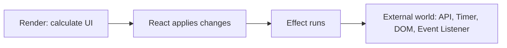
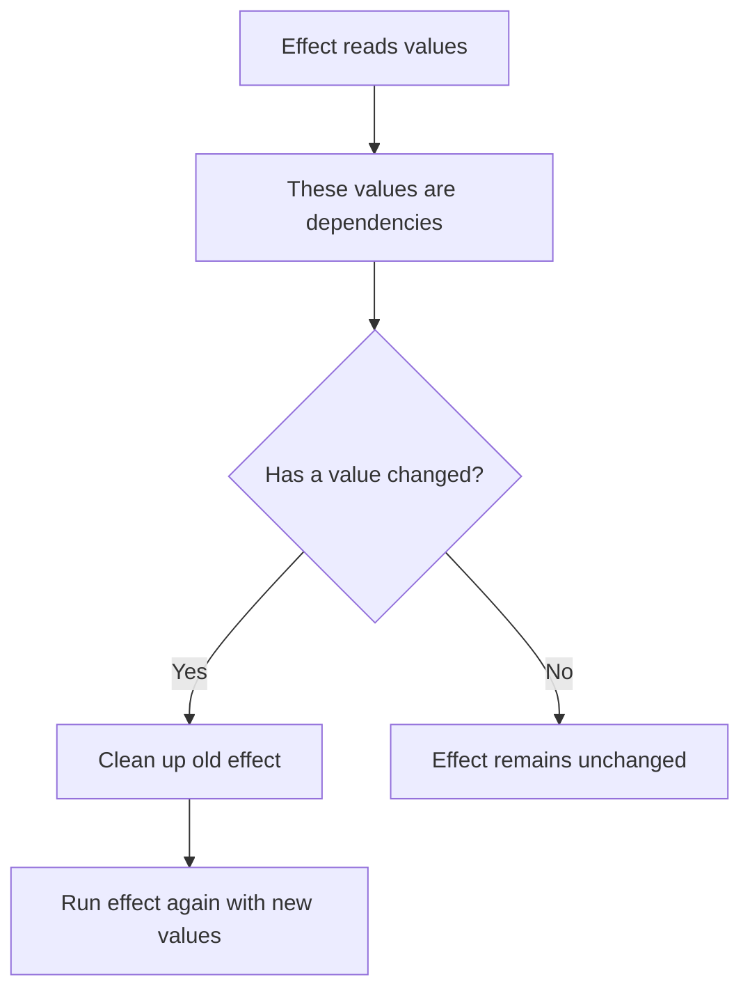
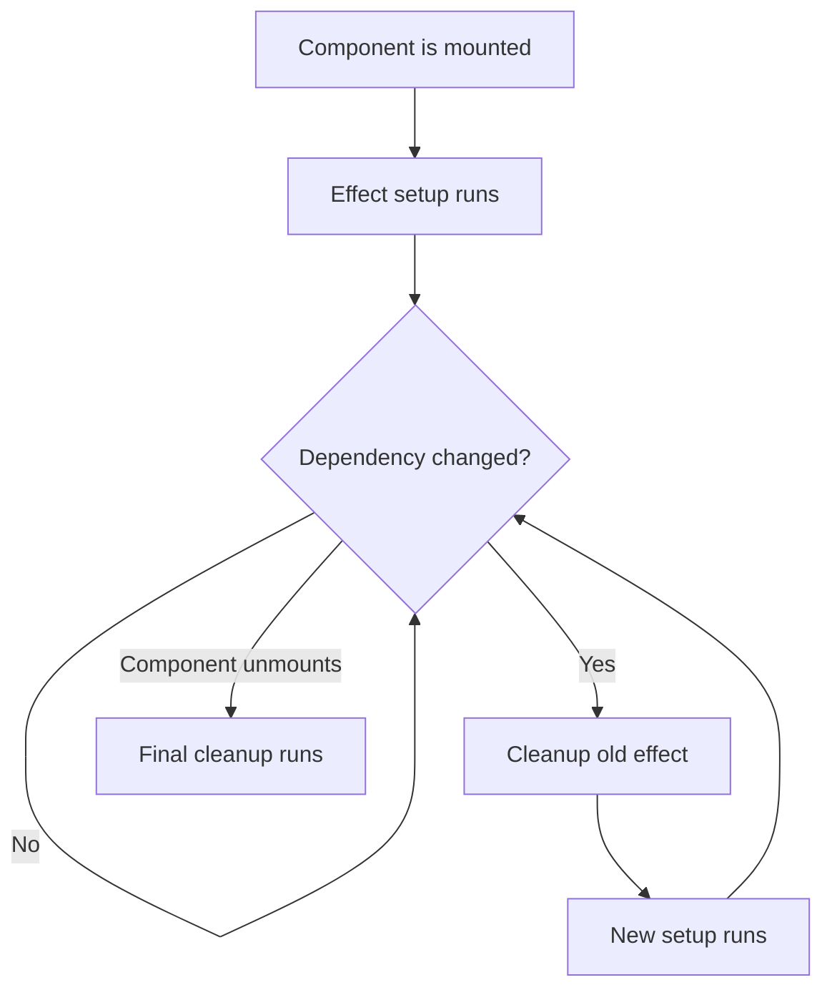

###### Topics

useEffect: Side Effects in React

- What is an effect in React?
- What is `useEffect` used for?
- Simple API call with `useEffect`

Dependencies and Cleanups

- Understanding the dependency array
- When an effect is re-executed
- Cleanup functions in simple examples (e.g. timer, event listener)

<br><br><br>
# ⚛️ useEffect: Side Effects in React

<br><br><br>
## 🧠 What is an Effect in React?

An **effect** in React is code that **does more than just compute the user interface**—it **impacts or synchronizes with something outside of React**. That's exactly what `useEffect` is for: with it, React describes how to synchronize a component with an **external system** like a network, browser API, timer, event listener, WebSocket, or DOM API ([useEffect – React](https://react.dev/reference/react/useEffect)).

The crucial difference is between **rendering** and **effect**:

- During **render**, React only calculates **what the UI should look like**.
- An **effect** happens **afterwards**, once React has applied the changes.

This is important because React components should remain as **pure as possible** during rendering. A component should not suddenly start a timer, load data, or register a listener on `window` during render. Such tasks belong in an effect, not directly in the function body of the component ([Synchronizing with Effects – React](https://react.dev/learn/synchronizing-with-effects)).

A simple diagram for this:



So, an effect is always useful if your component must interact with something **outside React logic**.

A small example:

```jsx
import { useEffect } from 'react';

function Cart({ count }) {
  useEffect(() => {
    document.title = `Cart (${count})`;
  }, [count]);

  return <h1>{count} items in cart</h1>;
}
```

Here, React computes the `<h1>` during rendering. Changing `document.title` is not part of the JSX output. It is a browser side effect and thus a typical case for `useEffect`.

An effect is **not** meant for deriving normal values from other values. For example, if you want to combine `firstName` and `lastName` into a `fullName`, you **don’t need an effect** for that. This should be done directly in render or with `useMemo`. React explicitly recommends not to use effects for unnecessary derived state ([You Might Not Need an Effect – React](https://react.dev/learn/you-might-not-need-an-effect)).

Example of something that **should not be an effect**:

```jsx
function Profile({ firstName, lastName }) {
  const fullName = `${firstName} ${lastName}`;
  return <p>{fullName}</p>;
}
```

Nothing outside React happens here. That's why `useEffect` is unnecessary.

<br><br><br>
## 🎯 What is `useEffect` Used For?

`useEffect` is used when your component must do something **after rendering** that involves the outside world. React lists typical cases as:

- Fetching data from an API
- Establishing a connection to a server
- Starting a timer
- Registering an event listener
- Controlling an external UI widget
- Using browser data like `document.title`, `localStorage`, or `navigator` ([useEffect – React](https://react.dev/reference/react/useEffect))

The crucial point: `useEffect` is not a general “just put your code here” hook. It is a tool for very specific tasks.

### Typical Proper Uses

For example, if you want to fetch data when loading a component, that's an external operation. If you want to subscribe to a browser resize event, that's also the case. If you want to update something every second, you need a timer. All these are classic cases.

### Typical Wrong Uses

Many beginners use `useEffect` for things that could be done more simply during rendering. For instance:

- Creating new state derived from props
- Filtering lists, even though this could be calculated directly
- Keeping values in sync that are just derived values

This often leads to unnecessary code, double renders, and bugs. That's why React points out that you **should first check whether you actually need an effect** ([You Might Not Need an Effect – React](https://react.dev/learn/you-might-not-need-an-effect)).

A typical decision framework:

| Question | Do I need `useEffect`? |
|---|---|
| I only compute UI from props and state | No |
| I talk to an API, timer, DOM, or browser event | Yes |
| I want to synchronize data between React and an external system | Yes |
| I only want to derive a value from others | No |

The basic form of `useEffect` looks like this:

```jsx
useEffect(() => {
  // effect code
}, [dependencies]);
```

The first part is the function containing the effect. The second part, the **dependency array**, controls when React re-executes the effect. We'll look at this in detail later.

<br><br><br>
## 🌐 Simple API Call with `useEffect`

A very classic use of `useEffect` is **fetching data from an API** after a component has been rendered. The browser provides the `fetch` API for this ([Fetch API – MDN](https://developer.mozilla.org/docs/Web/API/Fetch_API)).

A simple example:

```jsx
import { useEffect, useState } from 'react';

export default function UserList() {
  const [users, setUsers] = useState([]);
  const [loading, setLoading] = useState(true);
  const [error, setError] = useState(null);

  useEffect(() => {
    async function fetchUsers() {
      try {
        setLoading(true);
        setError(null);

        const response = await fetch('https://jsonplaceholder.typicode.com/users');

        if (!response.ok) {
          throw new Error('User data could not be loaded.');
        }

        const data = await response.json();
        setUsers(data);
      } catch (err) {
        setError(err.message);
      } finally {
        setLoading(false);
      }
    }

    fetchUsers();
  }, []);

  if (loading) {
    return <p>Loading data...</p>;
  }

  if (error) {
    return <p>Error: {error}</p>;
  }

  return (
    <ul>
      {users.map((user) => (
        <li key={user.id}>{user.name}</li>
      ))}
    </ul>
  );
}
```

Let's look at what happens here.

The state stores three things:

- `users`: the loaded data
- `loading`: whether loading is in progress
- `error`: whether an error occurred

Then comes the effect:

```jsx
useEffect(() => {
  async function fetchUsers() {
    ...
  }

  fetchUsers();
}, []);
```

The empty dependency array `[]` here means: **Run the effect after the component is first mounted**. People often say “once when the component loads.” Exactly, the effect runs after the mount of the component ([useEffect – React](https://react.dev/reference/react/useEffect)).

### Why is the API call placed in the effect?

Because a network request is a classic side effect. During rendering, React should only calculate what UI to display. A `fetch()` call starts a communication with a server. That is external work and therefore belongs in `useEffect`.

### Why is an inner async function used?

The effect function itself should not be `async` directly, because an effect must return **nothing** or a **cleanup function**. An `async` function always returns a Promise. That’s why, in practice, you often write an inner `async` function and invoke it inside the effect ([useEffect – React](https://react.dev/reference/react/useEffect)).

### What happens in case of errors?

A `fetch()` does not automatically throw for every HTTP error such as `404` or `500`. That’s why it's common to check `response.ok`. If that is `false`, you throw an error yourself. This is a very clean standard.

### A bit more robust with `AbortController`

If the component disappears while the request is still running, it's useful to abort the request. For this, the browser provides `AbortController` ([AbortController – MDN](https://developer.mozilla.org/docs/Web/API/AbortController)).

```jsx
import { useEffect, useState } from 'react';

export default function UserList() {
  const [users, setUsers] = useState([]);
  const [loading, setLoading] = useState(true);
  const [error, setError] = useState(null);

  useEffect(() => {
    const controller = new AbortController();

    async function fetchUsers() {
      try {
        setLoading(true);
        setError(null);

        const response = await fetch(
          'https://jsonplaceholder.typicode.com/users',
          { signal: controller.signal }
        );

        if (!response.ok) {
          throw new Error('User data could not be loaded.');
        }

        const data = await response.json();
        setUsers(data);
      } catch (err) {
        if (err.name !== 'AbortError') {
          setError(err.message);
        }
      } finally {
        if (!controller.signal.aborted) {
          setLoading(false);
        }
      }
    }

    fetchUsers();

    return () => {
      controller.abort();
    };
  }, []);

  if (loading) {
    return <p>Loading data...</p>;
  }

  if (error) {
    return <p>Error: {error}</p>;
  }

  return (
    <ul>
      {users.map((user) => (
        <li key={user.id}>{user.name}</li>
      ))}
    </ul>
  );
}
```

Here you already see an important property of effects: They can **clean up**, i.e. restore things. This is something we will cover in more detail later with timers and event listeners.

In React 19, `useEffect` remains a normal way to perform **client-side data fetching**, especially when a client component should fetch data directly in the browser. At the same time, React points out that fetching data directly in effects can have disadvantages depending on your architecture, such as loading only after rendering. That’s why frameworks often prefer built-in data loading mechanisms ([useEffect – React](https://react.dev/reference/react/useEffect)).

<br><br><br>
# 🔄 Dependencies and Cleanups

<br><br><br>
## 🧩 Understanding the Dependency Array

The **dependency array** is the second parameter of `useEffect`:

```jsx
useEffect(() => {
  // effect
}, [value1, value2]);
```

This array tells React **which values the effect depends on**. If any of these values change, the effect will be re-executed. React compares these values with `Object.is` ([useEffect – React](https://react.dev/reference/react/useEffect)).

Very important: The dependency array is **not** just a wishlist where you can put anything. It **must contain the reactive values used inside the effect**. This primarily includes:

- Props
- State
- Variables defined inside the component
- Functions defined inside the component ([Removing Effect Dependencies – React](https://react.dev/learn/removing-effect-dependencies))

A very helpful basic understanding is:

> The dependency array describes which values your effect reads from.

So if your effect uses `userId`, then `userId` belongs in the dependencies.

Example:

```jsx
function Profile({ userId }) {
  useEffect(() => {
    console.log('Loading profile for', userId);
  }, [userId]);

  return <p>Profile</p>;
}
```

Here the effect depends on `userId`. If `userId` changes, the effect should re-run.

### The Three Most Common Variants

| Syntax | Meaning | Typical Use |
|---|---|---|
| `useEffect(fn)` | Effect runs after every render | Rarely meaningful |
| `useEffect(fn, [])` | Effect runs after initial mount | One-time setup |
| `useEffect(fn, [a, b])` | Effect runs after mount and when `a` or `b` change | Sync with specific values |

### 1. Without Dependency Array

```jsx
useEffect(() => {
  console.log('Runs after every render');
});
```

Without an array, the effect runs **after every** render. That’s often too much and rarely needed. If the effect updates state, this can quickly lead to infinite loops.

### 2. With Empty Dependency Array

```jsx
useEffect(() => {
  console.log('Runs once after mount');
}, []);
```

This is the classic case for "only run once", for example, for an initial API call, an event listener, or a timer.

### 3. With Concrete Dependencies

```jsx
useEffect(() => {
  console.log('Category changed:', category);
}, [category]);
```

Here, the effect runs when the component is first mounted, and again every time `category` changes.

### Why is This So Important?

Because this allows React to know **when the effect is still up to date** and when it needs to be resynchronized. If you use a value inside the effect but leave it out of the dependencies, your effect might work with **stale values**. This causes typical bugs: stale data, unresponsive listeners, or incorrect timer logic ([Lifecycle of Reactive Effects – React](https://react.dev/learn/lifecycle-of-reactive-effects)).

A simple diagram:



A very common beginner mistake is to intentionally leave things out of the array so the effect “doesn’t run too often”. This may seem like a quick fix—but it’s usually logically incorrect. The right solution is not to hide dependencies, but to refactor the effect if it runs too often ([Removing Effect Dependencies – React](https://react.dev/learn/removing-effect-dependencies)).

<br><br><br>
## ⏱️ When Is an Effect Re-Executed?

An effect in React has its own small lifecycle. React does not just explain this as “mount and unmount,” but as repeated **starting** and **stopping** a synchronization ([Lifecycle of Reactive Effects – React](https://react.dev/learn/lifecycle-of-reactive-effects)).

The process is usually as follows:

1. The component is mounted.
2. React runs the effect.
3. Later, a dependency changes.
4. React cleans up the old effect.
5. React re-runs the effect, now with the new values.
6. When the component is removed, cleanup runs one last time.

Flowchart:



### A Concrete Example

```jsx
function Chat({ roomId }) {
  useEffect(() => {
    console.log('Connecting to room', roomId);

    return () => {
      console.log('Disconnecting from room', roomId);
    };
  }, [roomId]);

  return <p>Current room: {roomId}</p>;
}
```

If `roomId` is initially `general`, the effect first connects to `general`.

If `roomId` later becomes `tech`, **it’s not just a second start**, but:

1. React first calls the cleanup for `general`.
2. Then React starts the effect anew for `tech`.

This is crucial. So, when dependencies change, effects are handled following this pattern:

- **first cleanup**
- **then new setup**

That’s why effects should always be written so that they can be safely stopped and restarted.

### When, Exactly, Does an Effect Run?

Put simply, `useEffect` runs after React has applied the changes. React can, depending on context, decide exactly when to run effects relative to browser painting. For understanding, it's enough to know: `useEffect` **does not run during rendering**, but **afterwards** ([useEffect – React](https://react.dev/reference/react/useEffect)).

### What Triggers Re-Execution?

An effect is re-executed when at least one of its dependencies changes. This could be, for example:

- a prop is passed anew
- a state value changes
- a function or object defined in the component's body is recreated

The last point is especially important. In JavaScript, objects and functions are often "new" on every render, even if they appear identical. As a result, effects can unintentionally run more often. React explicitly describes this problem and explains you should avoid unnecessary object and function dependencies ([useEffect – React](https://react.dev/reference/react/useEffect)).

### Special in React 19: Development Mode Behavior

If you're working in development mode with `StrictMode`, React intentionally **runs the effect once extra as a test**: setup, cleanup, then setup again. This is to show you whether your cleanup works correctly ([useEffect – React](https://react.dev/reference/react/useEffect)).

This often causes confusion, because people think: "Why is my effect running twice?" The answer is: **because React tests your effect's robustness in development**.

In practice, this means:

- In development, an effect can run more often at first.
- In production, this extra test behavior does not happen.
- If your cleanup is correct, there is no problem.

This is especially relevant for API calls, timers, and event listeners. If you do not clean up correctly, development mode will reveal the bug right away.

<br><br><br>
## 🧹 Cleanup Functions in Simple Examples

A cleanup function is the **return value** of your effect:

```jsx
useEffect(() => {
  // Setup

  return () => {
    // Cleanup
  };
}, []);
```

React calls this function

- **before** the effect is re-executed due to changed dependencies
- and **when** the component is removed ([useEffect – React](https://react.dev/reference/react/useEffect))

So cleanup means: Everything your effect set up should be dismantled cleanly.

Typical examples are:

- Stopping a timer
- Removing event listeners
- Closing connections
- Aborting running requests

Without cleanup, you quickly get problems like duplicate listeners, multiple running timers, unnecessary memory usage, or behavior with outdated values.

<br><br><br>
### ⏲️ Timer with `setInterval`

If you use `setInterval`, the browser calls a function at fixed intervals ([Window: setInterval() – MDN](https://developer.mozilla.org/docs/Web/API/Window/setInterval)). This timer runs until you stop it with `clearInterval`. That's why a timer almost always needs cleanup.

A clean example:

```jsx
import { useEffect, useState } from 'react';

function Clock() {
  const [seconds, setSeconds] = useState(0);

  useEffect(() => {
    const intervalId = setInterval(() => {
      setSeconds((prevSeconds) => prevSeconds + 1);
    }, 1000);

    return () => {
      clearInterval(intervalId);
    };
  }, []);

  return <p>Elapsed seconds: {seconds}</p>;
}
```

Here’s what happens:

First, the component appears. Then the effect starts an interval, which increments the state every second. When the component is removed, React calls the cleanup and `clearInterval(intervalId)` stops the timer.

### Why is the Cleanup Important Here?

If you omit the cleanup, the interval keeps running even though the component may no longer be visible. It gets even worse if the effect runs again: another interval may start, resulting in a second, third, or fourth interval. This leads to erratic behavior.

A typical mistake would be:

```jsx
useEffect(() => {
  setInterval(() => {
    console.log('Tick');
  }, 1000);
}, []);
```

Here, an interval starts but is never stopped. That's not clean.

### Why Use the Functional Form for `setState`?

```jsx
setSeconds((prevSeconds) => prevSeconds + 1);
```

This is cleaner here because the new value depends on the old value. That way you avoid issues with stale state inside the interval.

### What Happens if Dependencies Change?

Suppose the interval depends on a `speed`:

```jsx
useEffect(() => {
  const intervalId = setInterval(() => {
    console.log('Tick');
  }, speed);

  return () => clearInterval(intervalId);
}, [speed]);
```

If `speed` changes, React first stops the old interval and then starts a new one with the new value. This is the intended behavior.

<br><br><br>
### 👂 Event Listeners with `addEventListener`

Another classic example is browser events. With `addEventListener`, for example, you can react to window size changes ([EventTarget: addEventListener() – MDN](https://developer.mozilla.org/docs/Web/API/EventTarget/addEventListener)).

A clean React example:

```jsx
import { useEffect, useState } from 'react';

function WindowWidth() {
  const [width, setWidth] = useState(window.innerWidth);

  useEffect(() => {
    function handleResize() {
      setWidth(window.innerWidth);
    }

    window.addEventListener('resize', handleResize);

    return () => {
      window.removeEventListener('resize', handleResize);
    };
  }, []);

  return <p>Window width: {width}px</p>;
}
```

Here, the effect registers a listener for the `resize` event. Every time the window size changes, `handleResize` runs and updates the state.

When the component is removed, the cleanup removes the listener. That's important so the browser doesn't keep trying to call a function for a component that no longer exists.

### Why Must the Same Function Be Removed?

For `removeEventListener`, you must pass the same function reference you used with `addEventListener`. That's why `handleResize` is defined inside the effect and we use exactly this reference to remove it. If you specify a different function there, the old listener is not removed ([EventTarget: addEventListener() – MDN](https://developer.mozilla.org/docs/Web/API/EventTarget/addEventListener)).

### What Happens Without Cleanup?

Without cleanup, the following may happen:

- The listener remains active even though the component is gone.
- Remounting the component adds additional listeners.
- One event then triggers the same code multiple times.
- The behavior seems unpredictable or “broken”, even though it’s just a missing cleanup.

### With Dependency

If your listener depends on a dependency, it will be cleanly replaced when it changes:

```jsx
useEffect(() => {
  function handleResize() {
    console.log('Current layout:', layoutName);
  }

  window.addEventListener('resize', handleResize);

  return () => {
    window.removeEventListener('resize', handleResize);
  };
}, [layoutName]);
```

If `layoutName` changes, React first removes the old listener and then registers a new one that works with the current value. This shows very well why cleanup and dependencies belong together: the effect should always match the **current component with the current values**.